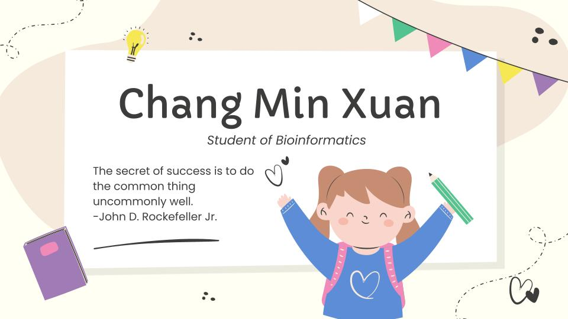

<!-- ### Hi there 👋 I'm Chang Min Xuan

**ChangMinXuan/ChangMinXuan** is a ✨ _special_ ✨ repository because its `README.md` (this file) appears on your GitHub profile.
Here are some ideas to get you started:
- 🔭 I’m currently working on ...
- 🌱 I’m currently learning ...
- 👯 I’m looking to collaborate on ...
- 🤔 I’m looking for help with ...
- 💬 Ask me about ...
- 📫 How to reach me: ...
- 😄 Pronouns: ...
- ⚡ Fun fact: ...
a dedicated student at University Technology Malaysia (UTM), where I am advancing my knowledge in Computer Science with a focus on Bioinformatics. My academic journey is driven by a passion for integrating computational methods with biological data, aiming to contribute significantly to the field of bioinformatics.
-->

<h1 align="center">Hi 👋, I'm Chang Min Xuan</h1>

a dedicated student at University Technology Malaysia (UTM), where I am advancing my knowledge in Computer Science with a focus on Bioinformatics. My academic journey is driven by a passion for integrating computational methods with biological data, aiming to contribute significantly to the field of bioinformatics.

- 🌏 I’m from **Kluang, Johor.**

- 👨‍💻 May view my e-portfolio at [https://eportfolio.utm.my/user/chang-min-xuan](https://eportfolio.utm.my/user/chang-min-xuan)

- 📝 I'm currently learning **Bioinformatics Modeling and Simulation**

- 📫 May reach me at **mxchang01@gmail.com**

<h3 align="left">Connect with me:</h3>

<h3 align="left">Languages and Tools:</h3>

        

&nbsp;

